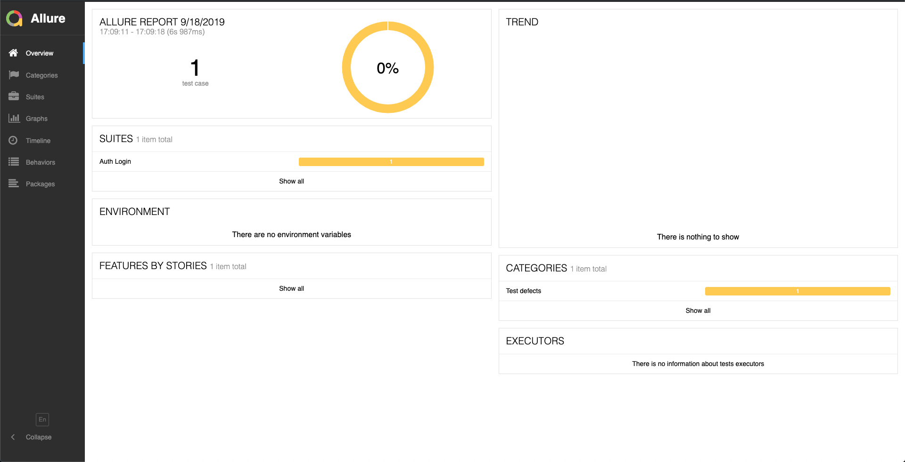

# Testing
Pair Programming exercise for testing.

## Setup
The setup is pretty straightforward:
```bash
git clone https://github.com/aureyia/exercise
cd exercise/testing
npm install
npm run cypress:open
```

## Excercise
The developers have created a new login page: https://www.zavamed.com/uk/auth/login, which has one BDD scenario written for it.
```gherkin
Feature: Auth Login

Scenario: Login
  Given a patient is on the page
  When they complete the form
  Then their account dashboard is displayed
```
And map-out and write the tests to cover that would cover this functionality.

## Running the Tests
### NPM Commands
Once the tests have been set up, we can run them with the Cypress UI: 
```bash
npm run cypress:open
```
We can also run it using the headless electron browser:
```bash
npm run cypress:test
```
## Reporting
We are using the allure mocha plugin for creating our reports since it offers us great support with Jenkins. To generate the report we can simply run:
```bash
npm run cypress:report
```
This will open up a browser similar to this:

